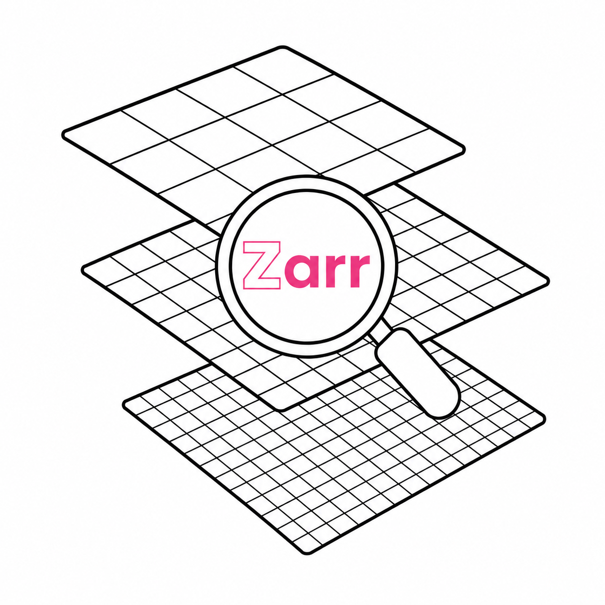

<p align="center">
  
</p>

# zarr-datafusion-search

This is a prototype for querying STAC or CMR style _metadata_ about Zarr arrays and groups using [DataFusion](https://datafusion.apache.org/), an extensible query engine written in Rust.

This concept was conceived by the team at [Earthmover](https://www.earthmover.io/) and is outlined in their whitepaper Level 2 Data Collections in Zarr / Icechunk.

## Why

The Earthmover whitepaper outlines several rationales for storing
_metadata_ in a Zarr store.  The most compelling cases are

- **Heterogeneous Arrays** - With the advent of Virtualizarr we are often representing chunks from source files that we don't control.  For Level 2 and Level 3 datasets like Sentinel 2 this means that virtual Zarr arrays have varying `dtypes`, `codecs` and `crs` values.
If the source arrays are heterogeneous, they cannot be concatenated along a dimension to form a single datacube.  Because of this we need an alternative to select or discover these arrays other than the normal coordinate or dimensional slicing we use with datacubes.

- **Synchronization** - Our current metadata management solutions (STAC, CMR, ODC) all use disconnected metadata stores which reference raw data assets in object storage.
This can present problems as systems require complex, fragile orchestration to maintain consistency between metadata indexes and source data.  Using Icechunk as store can alleviate this as array data and metadata updates can be completed in a single atomic transaction.

## Schema

To store this _metadata_, zarr-datafusion-search uses a convention where the Zarr store represents each metadata "field" with a 1-dimensional array in a root group named `"meta"`.

Users can define arbitrary schemas where the 1-dimensional arrays each use a `dtype` that has an equivalent Arrow type in our supported [mappings](https://github.com/developmentseed/zarr-datafusion-search/issues/12).  A concrete example might look like

- Inside a Zarr group named `"meta"`
    - A `datetime64[ms]` array named `"date"` with `n` timestamps named `"date"` with `n` timestamps.
    - A `VariableLengthUTF8` array named `"collection"` with `n` string values.
    - A `VariableLengthBytes` array named `"bbox"` with `n` binary values, where each value is a WKB-encoded Polygon (or MultiPolygon) with the bounding box of that Zarr record.

This project is under active development so these conventions may change.

## Python API

DataFusion distributes [Python bindings](https://datafusion.apache.org/python/) via the `datafusion` PyPI package.

In addition, DataFusion-Python supports [_custom table providers_](https://datafusion.apache.org/python/user-guide/data-sources.html#custom-table-provider). These allow you to define a custom data source as a standalone Rust package, compile it as its own standalone Python package, but then load it into DataFusion-Python at runtime.

> [!NOTE]
> The underlying DataFusion TableProvider ABI is not entirely stable. So for now
> you must use the same version of DataFusion-Python as the version of
> DataFusion used to compile the custom table provider.

## Installation
```bash
uv add zarr-datafusion-search
```

## Usage
```py
from zarr_datafusion_search import ZarrTable
from datafusion import SessionContext

# Create a new DataFusion session context
ctx = SessionContext()

# Register a specific Zarr store as a table named "zarr_data"
ctx.register_table_provider("zarr_data", ZarrTable("zarr_store.zarr"))

# Now you can run SQL queries against the Zarr data
df = ctx.sql("SELECT * FROM zarr_data;")
df.show()
```

