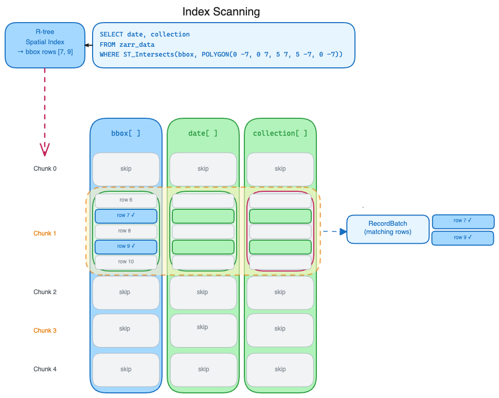

# Query Pipeline

The library uses [Apache Datafusion](https://datafusion.apache.org/) as the
foundation of its expression parser and execution planner.  To interact with
the custom Zarr schema described in [zarr.md](./zarr.md) we use a custom
Datafusion
[TableProvider](https://datafusion.apache.org/library-user-guide/custom-table-providers.html)

The `ZarrTableProvider` uses several techniques to try and improve filter
execution performance. There are 2 main drivers of execution cost.

1. Retrieving and deserializing Zarr chunks.
2. Evaluating expressions against chunks.

#### Non-indexed columns
In the most basic case, the TableProvider looks at the "columns" used in the
expression predicate and retrieves each chunk for the metadata arrays of these
"columns" to build a `RecordBatch` with a schema of just the predicate columns. 

This `RecordBatch` is evaluated against the filter to find matching rows.  If it
contains matching rows and there are additional projected "columns" in
expression, the chunk for that column's array is loaded and the indexes for the
matching rows are selected.

These selected rows are combined and added to the `RecordBatchStream`. 

#### Indexed columns
While the approach described above can be highly performant for many types of
columns and expressions, it can be slow for `dtypes` that are slow to
deserialize (variable length types) or when the predicate evaluation is
expensive (geodatafusion functions).

In these cases we want to use additional metadata or materialized indexes to
1. Reduce the number of chunks we retrieve and deserialize.
2. Reduce the number of values we check against the filter predicate.

Currently we support using [geo-index](https://github.com/georust/geo-index)
R-tree indexes. In this case the "basic" pipeline is short circuited.  The
`TableProvder` checks if the "column" in the predicate has an index.  If an
index exists, it uses it find the "rows" that satisfy the predicate.  The
`TableProvider` fetches only the chunks for those rows and then only decodes
those portions of the chunks.  The filter predicate is never used against the
raw values.

