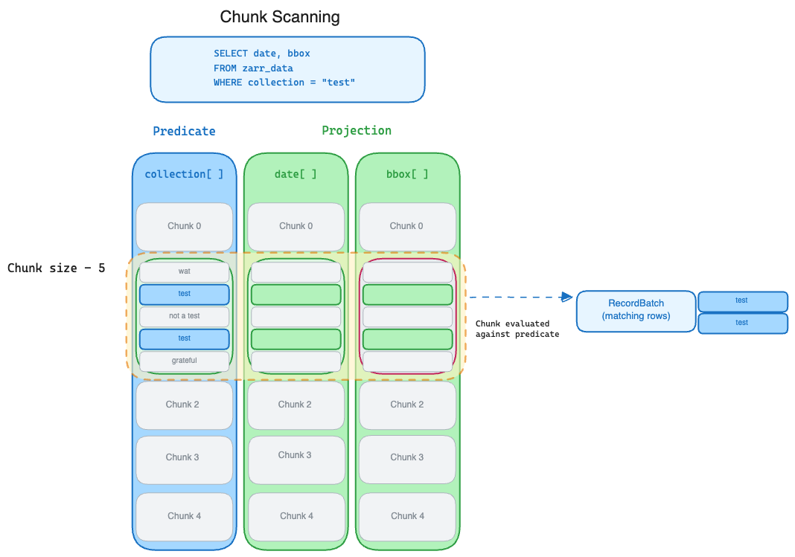

# Zarr Structure

`zarr-datafusion-search` uses a set of 1D arrays to store metadata,
treating them as if they were columns in a columnar storage format like
Parquet. 

#### Schema
The library requires a special group named `meta`.  It discovers each array stored in the `meta` group and
maps its Zarr v3 `dtype` to an Arrow type to build an
[Arrow schema](https://arrow.apache.org/cookbook/py/schema.html). These are the
current supported type mappings.

## Supported dtype mappings

| Zarr v3 dtype | Arrow type | Notes |
|---|---|---|
| `bool` | `Boolean` | |
| `int8` | `Int8` | |
| `int16` | `Int16` | |
| `int32` | `Int32` | |
| `int64` | `Int64` | |
| `uint8` | `UInt8` | |
| `uint16` | `UInt16` | |
| `uint32` | `UInt32` | |
| `uint64` | `UInt64` | |
| `float16` | `Float16` | |
| `float32` | `Float32` | |
| `float64` | `Float64` | |
| `bytes` | `BinaryView` | When the field name is `bbox`, mapped to WKB with EPSG:4326 CRS via the GeoArrow extension type instead |
| `r<N>` (raw bits) | `BinaryView` | |
| `string` | `Utf8View` | |
| `numpy.datetime64[s]` | `Timestamp(Second, None)` | |
| `numpy.datetime64[ms]` | `Timestamp(Millisecond, None)` | |
| `numpy.datetime64[us]` | `Timestamp(Microsecond, None)` | |
| `numpy.datetime64[ns]` | `Timestamp(Nanosecond, None)` | |
| `complex64` | — | Not supported |
| `complex128` | — | Not supported |

### Chunking
Because the `meta` arrays are combined by Datafusion into a single schema they
need to maintain chunk alignment.  This means that during array creation time,
the chunk size must be the same for each array.  And as data is appended, it needs to be appended to each array simultaneously.
Because the chunks are aligned across arrays, the library can treat the combined chunks similar to a Parquet row group.

This diagram demonstrates the chunk alignment

### Indexes
`zarr-datafusion-search` supports the optional use of materialized indexes to improve
scanning performance.  We use the following convention, if a `meta`
array is used in the filter predicate `zarr-datafusion-search` will look for a
group called `indexes` and search for an array of the same name as the
predicate array.  Currently the only index type supported are R-tree indexes
generated by the [geo-index](https://github.com/georust/geo-index)
library but we will continue to expand index support.
